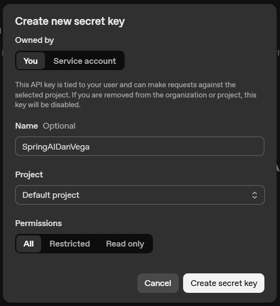

## Lesson 1

In this 1st lesson Dan Vega is supposed to talk a bit about using AI with Spring AI, managing AI API calls and keys.

### API Key Creation

In order to access any non-local LLM we need the specific API Key for that vendor. I had already created an account on OpenAI before and just had to create a new API Key. I have the impression that it would take buying some credits (>5 USD) to start using but I already did that at some point in the past.



I always have a hard time configuring environment variables for some reason, and this wasn't an exception, but I managed to add the OPENAI_API_KEY to my .bashrc file after a couple tries.

My verfification step, before creating a whole Spring Project, was to hit OpenAI with their own curl example:

```curl
curl https://api.openai.com/v1/responses   -H "Content-Type: application/json"   -H "Authorization: Bearer $OPENAI_API_KEY"   -d '{
    "model": "gpt-4.1",
    "input": "Tell me a three sentence bedtime story about a unicorn."
  }'
```

The response, as expected, was a big JSON with a lot of data, but in the middle of it was my desired output:

>*In a quiet, moonlit meadow, a gentle unicorn named Luna twinkled with stars along her silvery mane. Each night, she sprinkled shimmering dreams across the land, bringing peaceful sleep to all the creatures. As the sun began to rise, Luna vanished into the mist, promising to return with more magical dreams tomorrow night.*

### Spring Initializr

I always come back to the Spring Initializr VS Code extension, but you can always go to [https://start.spring.io/](https://start.spring.io/).

This is how I created the project:

1. Maven
2. Spring 3.5.7
3. Jar packaging
4. Java 21
5. Dependencies:
    * Spring Web
    * OpenAI
    * Lombok
    * Spring Boot DevTools

And I should be good to go.

### application.properties

Before beginning to code I should add some properties to this file on `lesson1/src/main/resources/application.properties`. I actually like to turn that file into a YAML file right away but since this is a very small project I won't do that. This is what I added:

```properties
spring.ai.openai.api-key=${OPENAI_API_KEY}
spring.ai.openai.model=gpt-4
```

Now I can finally start coding. I can actually run the application and it runs properly (just doesn't do anything yet).

### Chat Controller

In this first lesson we're just going to connect a controller of our own to Open AI's API.

All we need from Spring AI is the Chat Client:

```java
public interface ChatClient {
   static ChatClient create(ChatModel chatModel) {
      return create(chatModel, ObservationRegistry.NOOP);
   }

   static ChatClient create(ChatModel chatModel, ObservationRegistry observationRegistry) {
      return create(chatModel, observationRegistry, (ChatClientObservationConvention)null);
   }

   static ChatClient create(ChatModel chatModel, ObservationRegistry observationRegistry, @Nullable ChatClientObservationConvention observationConvention) {
      Assert.notNull(chatModel, "chatModel cannot be null");
      Assert.notNull(observationRegistry, "observationRegistry cannot be null");
      return builder(chatModel, observationRegistry, observationConvention).build();
   }

   static Builder builder(ChatModel chatModel) {
      return builder(chatModel, ObservationRegistry.NOOP, (ChatClientObservationConvention)null);
   }

   static Builder builder(ChatModel chatModel, ObservationRegistry observationRegistry, @Nullable ChatClientObservationConvention customObservationConvention) {
      Assert.notNull(chatModel, "chatModel cannot be null");
      Assert.notNull(observationRegistry, "observationRegistry cannot be null");
      return new DefaultChatClientBuilder(chatModel, observationRegistry, customObservationConvention);
   }

   ChatClientRequestSpec prompt();

   ChatClientRequestSpec prompt(String content);

   ChatClientRequestSpec prompt(Prompt prompt);

   Builder mutate();
}
```

This is an interface, but due to our configurations on properties Spring AI is able to auto-generate a Chat Client Builder that we can access to create our Chat Client. Spring also injects that Builder if you ask it nicely.

Bellow is how our base Controller will look like.

```java
@RestController
public class ChatController {
    
    private final ChatClient chatClient;

    ChatController(ChatClient.Builder builder){
        this.chatClient = builder.build();
    }
}
```

Now we just need an actual endpoint. I'll create a very basic one that asks the API for a dad joke.

```java
@RestController
public class ChatController {
    
    private final ChatClient chatClient;

    ChatController(ChatClient.Builder builder){
        this.chatClient = builder.build();
    }

    @GetMapping()
    public String getDadJoke() {
        return chatClient.prompt("Tell me a dad joke").call().content();
    }
}
```

Running it, obviously, doesn't do much. But I can now send it a get request at the root and get a result back:

> Why don't skeletons fight each other? They don't have the guts!

I stressed a bit trying to curl it but it took longer than my dopamine adicted brain could wait for, so I just accessed it via browser (I'll install Postman before next lesson).

This ends our first lesson. Just the first steps, but enough to get us started.
